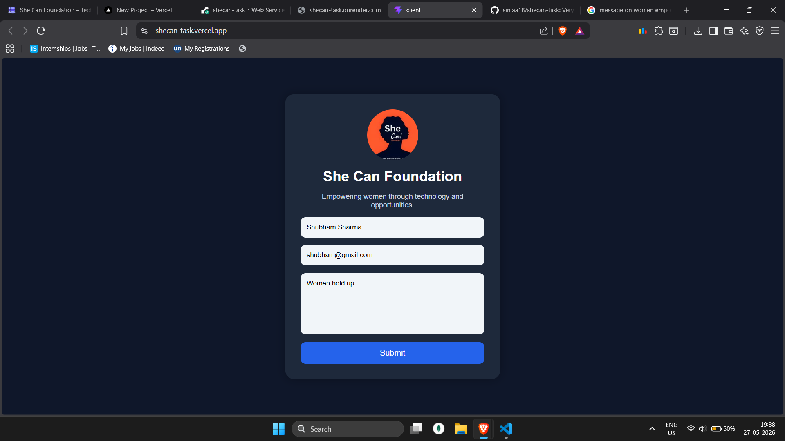

# She Can Foundation Internship Task

A simple full stack contact form built using MERN stack.

## Features
- Responsive UI
- Form Validation
- MongoDB Integration
- REST API
- Success Notifications

## Tech Stack
- React
- Node.js
- Express.js
- MongoDB

## Screenshots

## Live Demo
Frontend: https://shecan-task.vercel.app/

Backend: https://shecan-task.onrender.com/